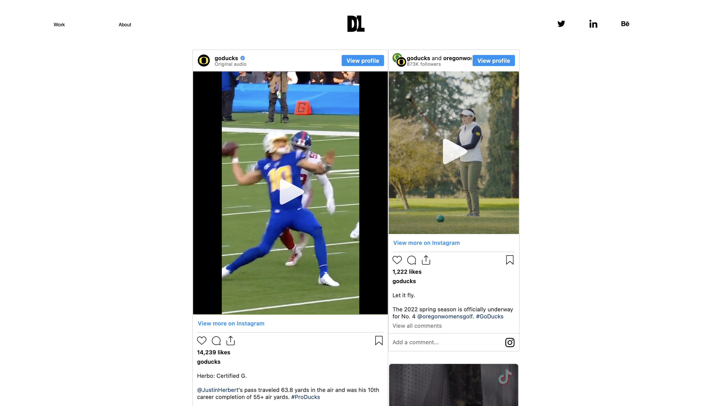

# Portfolio_D

Welcome to Portfolio_D, a portfolio demo built using HTML, CSS, and JavaScript.

This was a creative project made for a peer at the University of Oregon. He worked for GoDucks, displaying what he's made at UO is the main focus of the website. 

The website features forward thinking web design, fullscreen high quality images and an easy to navigate interface.

To see a demo visit: https://bigo96.github.io/Portfolio_D/

# Credit

This Portfolio website was created by Oscar Epp

All projects featured on the website were created by Davis Long